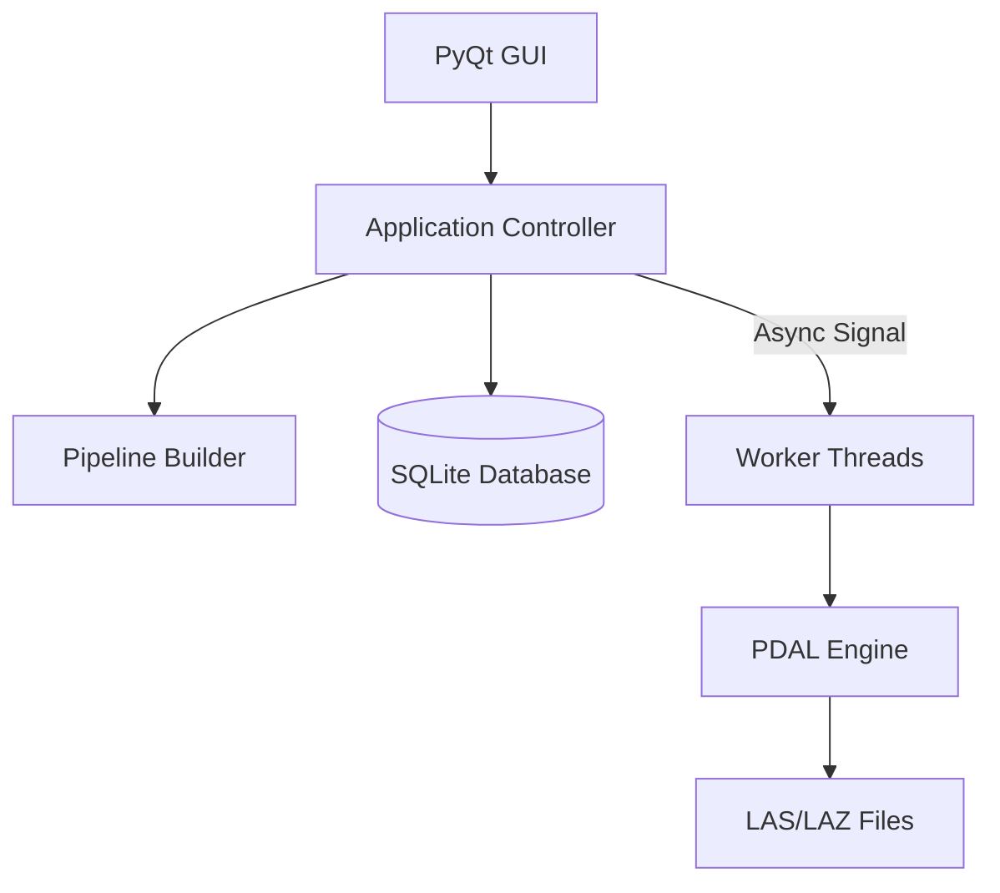
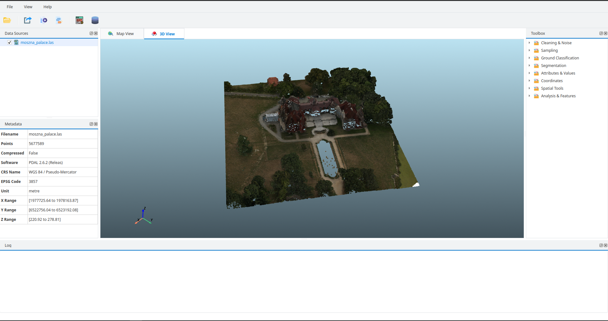

# 🌩️ PDAL Desktop Toolkit

> **A high-performance GUI application for processing, analyzing, and managing LiDAR point cloud data.**


## 📖 Overview

**PDAL Desktop Toolkit** is a comprehensive engineering tool designed to bridge the gap between complex command-line PDAL pipelines and interactive visual analysis. It allows GIS specialists to execute advanced point cloud processing tasks (filtering, cropping, merging) through a user-friendly interface while managing dataset metadata in a local database.

The application addresses the challenge of "blind processing" by providing real-time feedback, batch processing capabilities, and a structured workflow for massive LiDAR datasets (LAS/LAZ).

---

## 🏗️ Architecture & Design Pattern

This project is built on a strict **MVC (Model-View-Controller)** pattern to ensure scalability and maintainability. It heavily utilizes **Multi-threading** to keep the GUI responsive during intensive point cloud operations.

### Core Components
* **Controller Layer:** Coordinates logic between UI and Data (`core/controllers/`).
* **Worker Threads:** Uses `QThread` for non-blocking execution of PDAL pipelines (`core/workers.py`, `core/filter_worker.py`).
* **Pipeline Builder:** A dynamic engine that constructs PDAL JSON pipelines programmatically based on user input (`core/pipeline_builder.py`).
* **Database Layer:** Manages project state and metadata using a repository pattern (`core/database/`).



## ✨ Key Features

### 🛠️ Advanced Processing Tools
* Dynamic Filtering: Apply range, classification, and expression-based filters.
* Smart Cropping: Crop point clouds using 2D bounds or polygon inputs.
* Batch Processing: Process multiple files simultaneously with a unified pipeline.
* Merging & Exporting: Combine fragmented datasets and export to various formats.

### 📊 Data Management & Analysis
* Metadata Inspector: View header info, CRS, and bounding boxes instantly.
* Statistics Engine: Calculate point counts, density, and Z-min/max values.
* Project Database: Persist dataset information and processing history.

### 🔌 Modular Toolbox System
* The application features an extensible ToolboxPanel where new processing modules can be registered and plugged in without altering the core engine.

## 📂 Project Structure

```bash
pdal-desktop-toolkit/
├── app.py                  # Entry Point
├── core/
│   ├── controllers/        # Logic Controllers (MVC) 🧠
│   ├── database/           # SQLite & Models 💾
│   ├── workers/            # Async Threads for PDAL ⚡
│   └── pipeline_builder.py # JSON Pipeline Generator 🛠️
├── data/                   # Data Handlers (Reader/Writer)
└── ui/                     # PyQt5 Widgets & Dialogs 🎨
    ├── main_window.py
    ├── toolbox_panel.py
    └── resources/
```

## 🚀 Installation & Setup

### 1. Clone the Repository
```bash
git clone https://github.com/muzafferbulut/pdal-desktop-toolkit.git
cd pdal-desktop-toolkit
```

### Environment Setup

```bash
# Create a fresh environment
conda create -n pdal-gui python=3.9
conda activate pdal-gui

# Install Core Geospatial Dependencies
conda install -c conda-forge pdal python-pdal gdal

# Install GUI & Utility Dependencies
pip install -r requirements.txt
```

### Run the Application

```bash
python app.py
```

